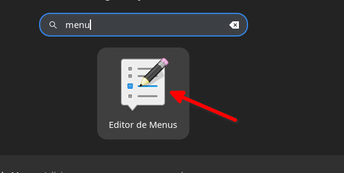
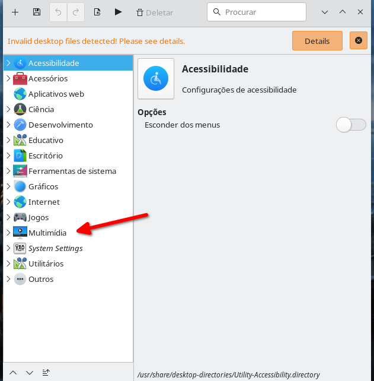
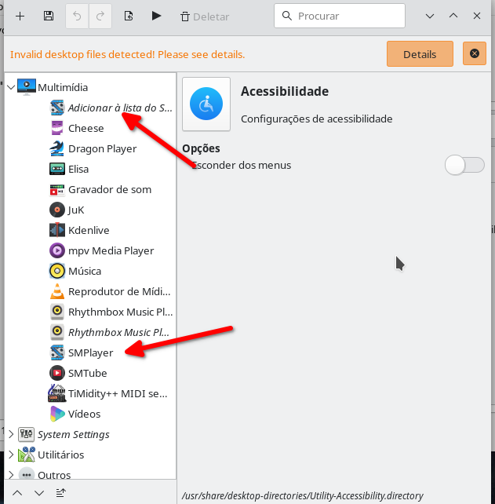
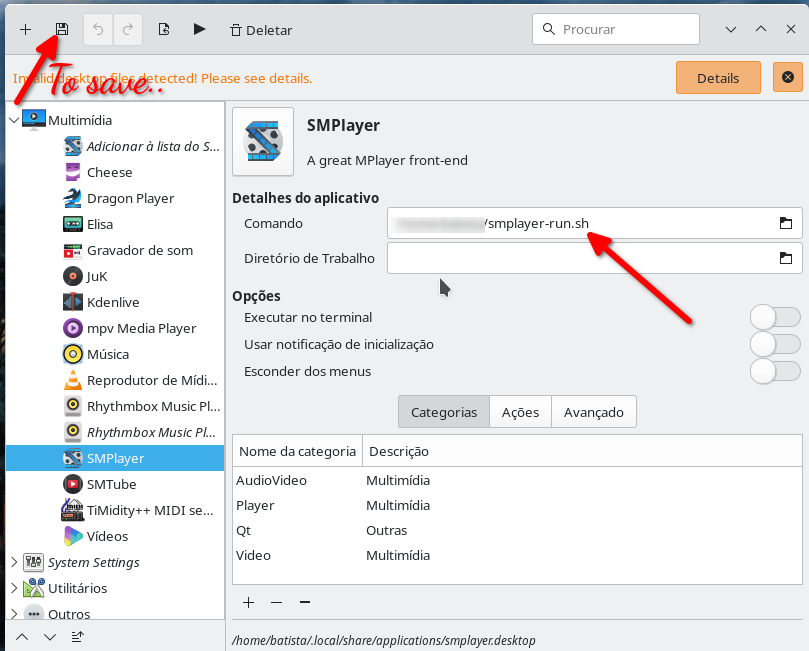
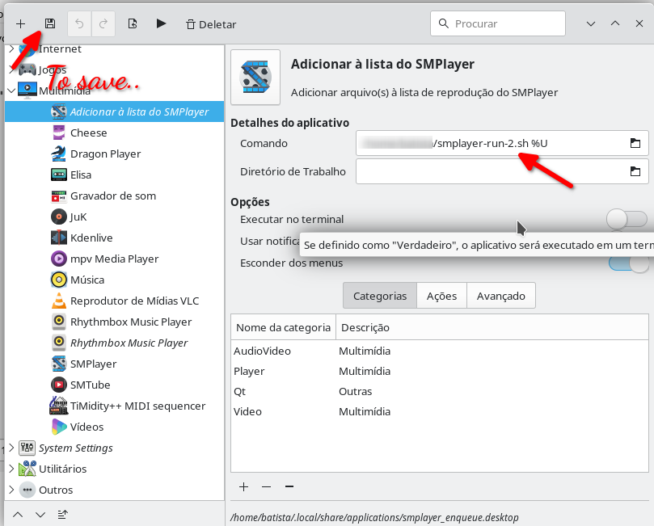

### How to run smplayer on wayland, on debian-12 Bookworm

  When I installed debian12 on my computer, my smplayer didn't work anymore. So I needed to find another way to make it work. If not I would have to use a version installed through Snap, Flatpak or Appimage. That are the alternative methods that are indicated on the smplayer website to works.

Link to altenatives: [Altenative Smplayer](https://www.smplayer.info/pt_BR/download-linux)

I created 2 script similar to change the application that is settled on "Menu Edit".

1 - (smplayer-run.sh), To run and open simple video, and (smplayer-run-2.sh), add up to 9 files to smplayer list and run.

Create this script anyplace that you have permission:
Then, give to both: chmod 775 your-script-name.sh

```bash
#smplayer-run.sh  = filename
#!/usr/bin/bash

export WAYLAND_DISPLAY=wayland-1
/usr/bin/smplayer "$1"

```

And

```bash
#smplayer-run-2.sh  = filename
#!/usr/bin/bash

export WAYLAND_DISPLAY=wayland-1
/usr/bin/smplayer -add-to-playlist "$1" "$2" "$3" "$4" "$5" "$6" "$7" "$8" "$9"

```

---

Now set up the both files to (menu edit), following these steps:

###  01




### 02



### 03



### 04



### 05



---

That's it...

I hope this  is useful for someone...


